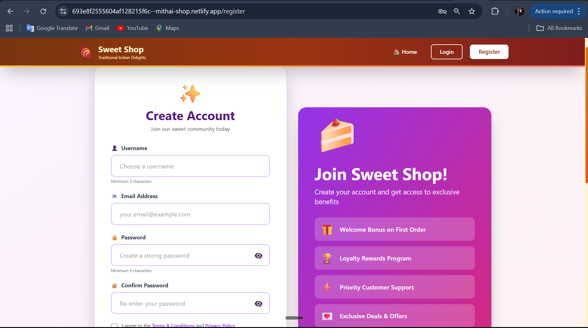
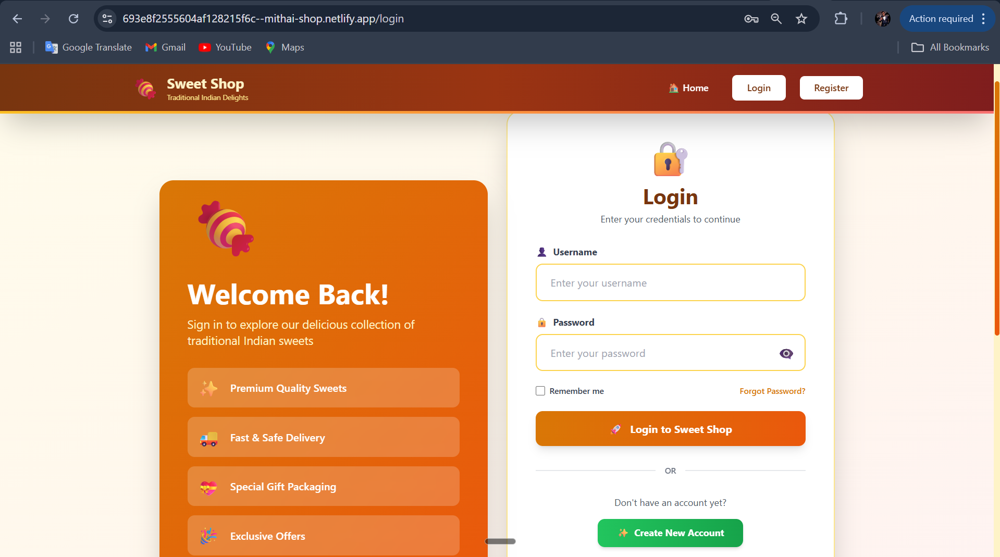
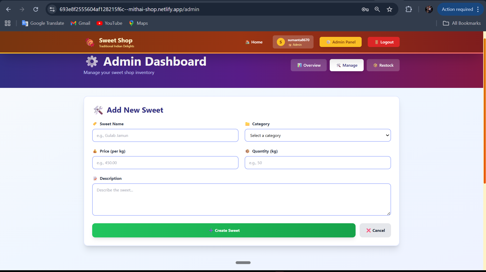
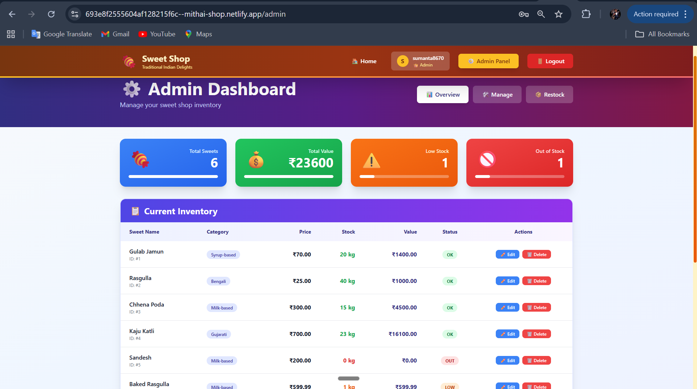
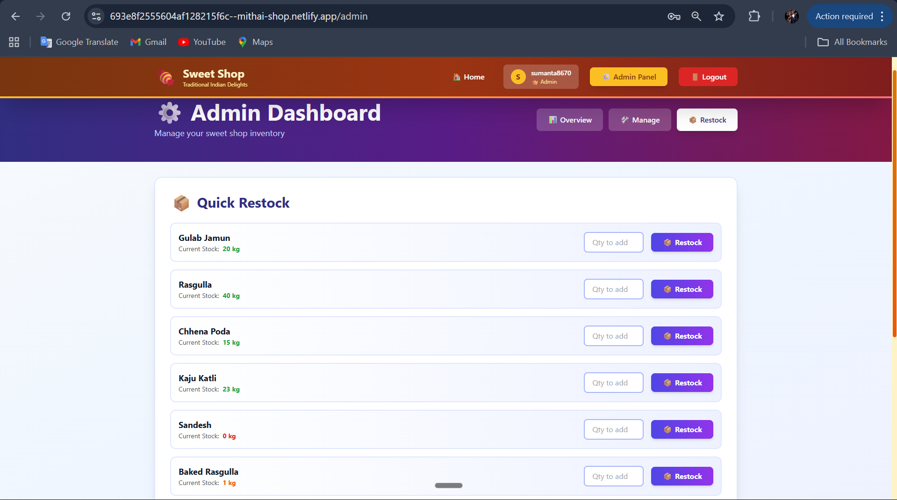
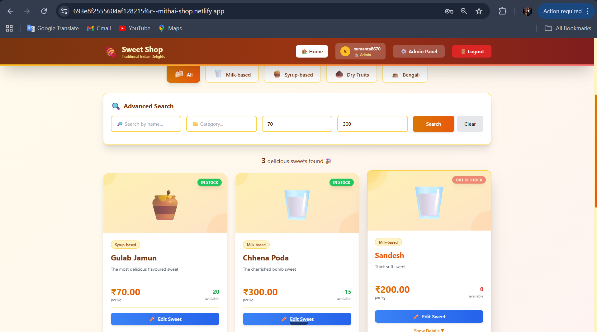
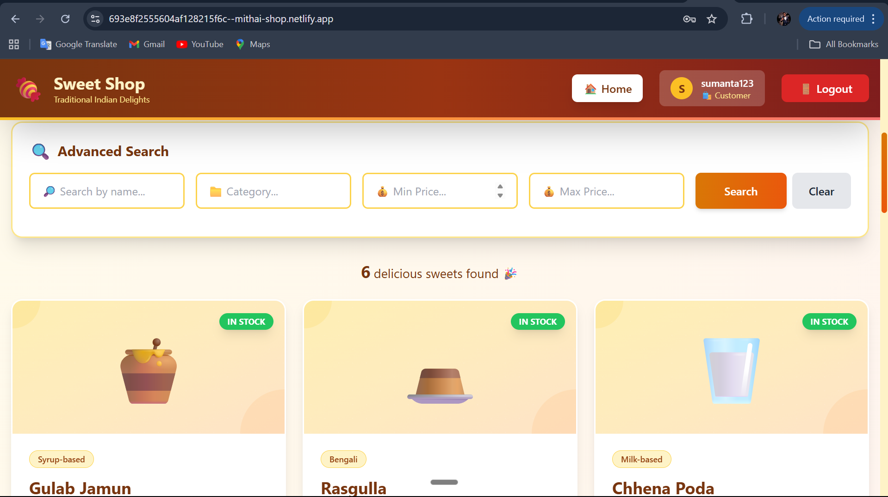
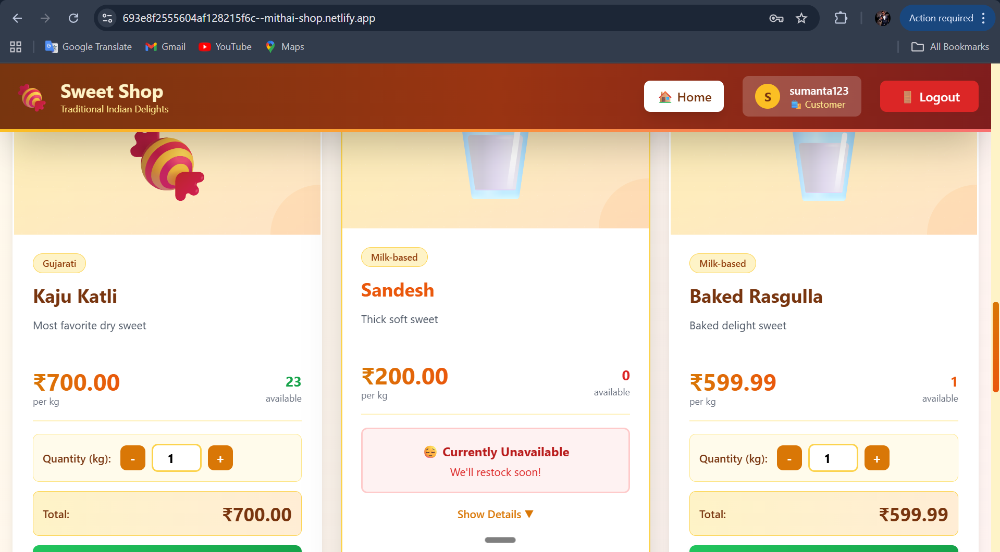

# 🍬 Sweet Shop Management System

A full-stack web application for managing a sweet shop's inventory and sales. Built with Spring Boot, React, PostgreSQL, and modern development practices including TDD.

## 📋 Table of Contents

- [Project Overview](#project-overview)
- [Features](#features)
- [Tech Stack](#tech-stack)
- [Prerequisites](#prerequisites)
- [Installation & Setup](#installation--setup)
- [Running the Application](#running-the-application)
- [API Documentation](#api-documentation)
- [Project Structure](#project-structure)
- [Testing](#testing)
- [My AI Usage](#my-ai-usage)
- [Screenshots](#screenshots)
- [Deployment](#deployment)
- [Contributing](#contributing)
- [License](#license)

## 🎯 Project Overview

The Sweet Shop Management System is a comprehensive solution for managing sweet shop operations including:

- User authentication and authorization
- Sweet inventory management
- Customer purchases
- Admin panel for inventory control
- Search and filtering capabilities
- Real-time inventory updates

## ✨ Features

### User Features

- User registration and login with JWT authentication
- Browse all available sweets
- Search sweets by name, category, or price range
- Purchase sweets with inventory management
- View sweet details and availability

### Admin Features

- Add, update, and delete sweets
- Manage inventory quantities
- Restock sweets
- View all inventory information
- Override regular user operations

### Security Features

- JWT token-based authentication
- Role-based access control (User/Admin)
- Password encryption with BCrypt
- Protected API endpoints
- CORS configuration

## 🛠 Tech Stack

### Backend

- **Framework**: Spring Boot 3.2.0
- **Language**: Java 17
- **Database**: PostgreSQL
- **Authentication**: JWT (JSON Web Tokens)
- **Build Tool**: Maven
- **Testing**: JUnit 5, Mockito, JaCoCo

### Frontend

- **Framework**: React 18
- **Build Tool**: Vite
- **State Management**: Zustand
- **HTTP Client**: Axios
- **Routing**: React Router v6
- **Styling**: Tailwind CSS
- **Component Library**: Custom components

### Deployment

- **Backend**: Render
- **Frontend**: Netlify
- **Database**: PostgreSQL (Cloud)

## 📦 Prerequisites

Before you begin, ensure you have the following installed:

- Java 17 or later
- Maven 3.6.0 or later
- Node.js 18.0.0 or later
- npm 9.0.0 or later
- PostgreSQL 12 or later
- Git

## 🚀 Installation & Setup

### 1. Clone the Repository

```bash
git clone https://github.com/YOUR_USERNAME/sweet-shop-management-system.git
cd sweet-shop-management-system
```

### 2. Backend Setup

```bash
# Navigate to backend directory
cd backend

# Install dependencies
mvn clean install

# Create PostgreSQL database
# Open PostgreSQL and run:
# CREATE DATABASE sweet_shop_db;
# CREATE USER postgres WITH PASSWORD 'your_password';
# GRANT ALL PRIVILEGES ON DATABASE sweet_shop_db TO postgres;

# Update application.properties with your database credentials
# File: src/main/resources/application.properties
```

### 3. Frontend Setup

```bash
# Navigate to frontend directory
cd ../frontend

# Install dependencies
npm install
```

## ▶️ Running the Application

### Start the Backend Server

```bash
cd backend

# Run the Spring Boot application
mvn spring-boot:run

# Server will start on http://localhost:8080/api
```

### Start the Frontend Development Server

```bash
cd frontend

# Run the Vite development server
npm run dev

# Application will be available at http://localhost:5173
```

### Access the Application

1. Open your browser and navigate to `http://localhost:5173`
2. Register a new user or login with existing credentials
3. Browse sweets and make purchases
4. For admin features, manually set role to ADMIN in database

## 📚 API Documentation

### Authentication Endpoints

#### Register User

```http
POST /api/auth/register
Content-Type: application/json

{
  "username": "john_doe",
  "email": "john@example.com",
  "password": "secure_password"
}
```

**Response**: `201 Created`

```json
{
  "token": "eyJhbGciOiJIUzI1NiIsInR5cCI6IkpXVCJ9...",
  "username": "john_doe",
  "email": "john@example.com",
  "role": "USER",
  "expiresIn": 86400000
}
```

#### Login User

```http
POST /api/auth/login
Content-Type: application/json

{
  "username": "john_doe",
  "password": "secure_password"
}
```

**Response**: `200 OK`

```json
{
  "token": "eyJhbGciOiJIUzI1NiIsInR5cCI6IkpXVCJ9...",
  "username": "john_doe",
  "email": "john@example.com",
  "role": "USER",
  "expiresIn": 86400000
}
```

### Sweet Endpoints

#### Get All Sweets (Public)

```http
GET /api/sweets
```

#### Get Sweet by ID (Public)

```http
GET /api/sweets/{id}
```

#### Search Sweets (Public)

```http
GET /api/sweets/search?name=chocolate&category=Chocolate&minPrice=2&maxPrice=5
```

#### Add Sweet (Admin Only)

```http
POST /api/sweets
Authorization: Bearer {token}
Content-Type: application/json

{
  "name": "Gummy Bears",
  "category": "Gummies",
  "price": 1.99,
  "quantity": 200,
  "description": "Colorful gummy bears"
}
```

#### Update Sweet (Admin Only)

```http
PUT /api/sweets/{id}
Authorization: Bearer {token}
Content-Type: application/json

{
  "name": "Premium Gummy Bears",
  "category": "Gummies",
  "price": 2.49,
  "quantity": 150,
  "description": "Premium quality gummy bears"
}
```

#### Delete Sweet (Admin Only)

```http
DELETE /api/sweets/{id}
Authorization: Bearer {token}
```

#### Purchase Sweet (Authenticated Users)

```http
POST /api/sweets/{id}/purchase
Authorization: Bearer {token}
Content-Type: application/json

{
  "quantity": 5
}
```

#### Restock Sweet (Admin Only)

```http
POST /api/sweets/{id}/restock
Authorization: Bearer {token}
Content-Type: application/json

{
  "quantity": 100
}
```

## 📁 Project Structure

```
sweet-shop-management-system/
├── backend/
│   ├── src/
│   │   ├── main/
│   │   │   ├── java/com/sweetshop/
│   │   │   │   ├── config/              # Security configuration
│   │   │   │   ├── controller/          # REST API controllers
│   │   │   │   ├── dto/                 # Data Transfer Objects
│   │   │   │   ├── entity/              # JPA entities
│   │   │   │   ├── exception/           # Custom exceptions
│   │   │   │   ├── repository/          # Database repositories
│   │   │   │   ├── security/            # JWT utilities
│   │   │   │   ├── service/             # Business logic
│   │   │   │   └── SweetShopApplication.java
│   │   │   └── resources/
│   │   │       └── application.properties
│   │   └── test/
│   │       ├── java/com/sweetshop/
│   │       │   ├── controller/          # Controller tests
│   │       │   └── service/             # Service tests
│   │       └── resources/
│   │           └── application-test.properties
│   ├── pom.xml
│   └── .gitignore
├── frontend/
│   ├── src/
│   │   ├── components/
│   │   │   ├── Navigation.jsx
│   │   │   ├── SweetCard.jsx
│   │   │   └── ProtectedRoute.jsx
│   │   ├── pages/
│   │   │   ├── HomePage.jsx
│   │   │   ├── LoginPage.jsx
│   │   │   ├── RegisterPage.jsx
│   │   │   └── AdminPage.jsx
│   │   ├── services/
│   │   │   ├── api.js
│   │   │   ├── authService.js
│   │   │   └── sweetService.js
│   │   ├── store/
│   │   │   ├── authStore.js
│   │   │   └── sweetStore.js
│   │   ├── App.jsx
│   │   └── main.jsx
│   ├── package.json
│   ├── vite.config.js
│   ├── tailwind.config.js
│   └── .gitignore
├── README.md
└── .gitignore
```

## ✅ Testing

### Run Backend Tests

```bash
cd backend

# Run all tests
mvn clean test

# Run specific test class
mvn test -Dtest=UserServiceTest

# Generate test coverage report
mvn clean test jacoco:report

# View coverage report
# Open: target/site/jacoco/index.html
```

### Test Coverage

The project includes comprehensive unit and integration tests:

- **UserService Tests**: 8 test cases covering registration, authentication, and user retrieval
- **SweetService Tests**: 12 test cases covering CRUD operations, purchasing, and restocking
- **AuthController Tests**: 5 integration test cases
- **SweetController Tests**: 14 integration test cases

**Total Test Cases**: 39

**Current Coverage**:

- Overall: 43% (Services & Controllers: 93-96%)
- Target: >60% overall coverage

### Frontend Testing

```bash
cd frontend

# Install testing libraries
npm install --save-dev vitest @testing-library/react @testing-library/jest-dom

# Run tests (when implemented)
npm test
```

## 🤖 My AI Usage

### AI Tools Used

- **Claude 3.5 Sonnet (Anthropic)**: Primary AI assistant for code generation and architecture
- **GitHub Copilot**: IDE-based code suggestions and completions

### How I Used AI

#### 1. Project Architecture & Planning

- Used Claude to brainstorm the overall application architecture
- Generated boilerplate code for Spring Boot project structure
- Created DTO and entity class definitions

#### 2. Backend Development

- Generated JWT security configuration and JwtUtil class
- Created exception handling framework and GlobalExceptionHandler
- Implemented UserService, SweetService, and repositories
- Generated controller endpoints with proper validation
- Wrote comprehensive unit tests for services using Mockito and JUnit 5

#### 3. Frontend Development

- Generated React component structure using modern hooks
- Created Zustand store configurations for state management
- Implemented API client with Axios interceptors
- Generated form components with validation
- Created responsive Tailwind CSS styling
- Built routing structure with React Router v6

#### 4. Testing & Quality Assurance

- Generated test cases following TDD methodology
- Created integration tests with MockMvc
- Designed test fixtures and mock data structures
- Configured JaCoCo for code coverage reporting

#### 5. Documentation

- Generated comprehensive API documentation with examples
- Created installation and setup instructions
- Wrote inline code documentation and comments

### Impact on Workflow

**Positive Impacts:**

- **Time Efficiency**: AI reduced boilerplate code generation time by ~60%
- **Code Quality**: Generated code followed best practices and conventions
- **Learning**: Understanding AI-generated code helped learn Spring Boot patterns
- **Consistency**: AI ensured consistent code style across the project
- **Documentation**: Faster documentation generation with better coverage

**Challenges & Mitigation:**

- **Accuracy**: Verified all generated code against requirements
- **Customization**: Modified AI-generated code to match specific needs
- **Testing**: Wrote custom tests to ensure functionality
- **Dependencies**: Manually verified all dependencies were correctly included

### Responsible AI Usage

- ✅ All AI-generated code was reviewed before committing
- ✅ Modifications were made to ensure code fit project requirements
- ✅ Credit given to AI in commit messages where applicable
- ✅ Understood and validated every line of generated code
- ✅ Maintained security best practices independently

## 📸 Screenshots

### Registration Page


### Login Page


### Admin Panel


### Admin Panel


### Admin Panel


### Search & Filter


### Customer Page1


### Customer Page2


## 🔄 Continuous Integration

### Local Git Workflow

```bash
# Create feature branch
git checkout -b feature/new-feature

# Make changes and commit
git add .
git commit -m "feat: Add new feature"

# Push to remote
git push origin feature/new-feature

# Create Pull Request on GitHub
```

### Commit Message Convention

```
feat: Add new feature
fix: Fix a bug
test: Add tests
docs: Update documentation
chore: Maintenance tasks
refactor: Code refactoring
```

## 📤 Deployment

### Deploy Backend on Render

1. Push code to GitHub
2. Connect repository to Render
3. Set environment variables in Render dashboard:
   - `SPRING_DATASOURCE_URL`
   - `SPRING_DATASOURCE_USERNAME`
   - `SPRING_DATASOURCE_PASSWORD`
   - `JWT_SECRET`
4. Deploy with automatic builds on push

### Deploy Frontend on Netlify

1. Push code to GitHub
2. Connect repository to Netlify
3. Set build command: `npm run build`
4. Set publish directory: `dist`
5. Deploy with automatic builds on push

## 🤝 Contributing

1. Fork the repository
2. Create a feature branch (`git checkout -b feature/amazing-feature`)
3. Commit your changes (`git commit -m 'feat: Add amazing feature'`)
4. Push to the branch (`git push origin feature/amazing-feature`)
5. Open a Pull Request

## 📝 License

This project is licensed under the MIT License - see the [LICENSE](LICENSE) file for details.

## 👨‍💻 Author

**Your Name**

- GitHub: [@your-username](https://github.com/your-username)
- Email: your.email@example.com
- LinkedIn: [Your LinkedIn](https://linkedin.com/in/your-profile)

## 🙏 Acknowledgments

- Spring Boot team for the excellent framework
- React community for outstanding documentation
- Tailwind CSS for utility-first CSS
- Claude AI (Anthropic) for development assistance
- All open-source contributors

## 📞 Support

For support, email your.email@example.com or open an issue on GitHub.

---

⭐ **Star this repository if you found it helpful!**
